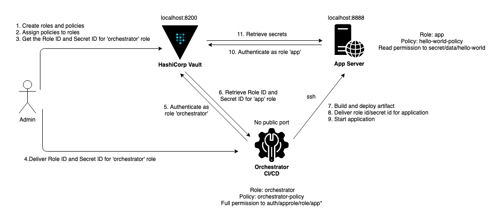

# Purpose

- This project serves as an interactive learning for `HashiCorp Vault's AppRole` and to an extend `Docker` container.

# Diagram



# Installation

- If you don't have Docker, please install it: https://docs.docker.com/get-docker/

- Check if you have docker-compose on your machine

``` shell
docker-compose --version
```

- If you have Docker Desktop, you don't need to do anything. Otherwise, please follow this instruction to install: https://docs.docker.com/compose/install/

# Run

- To run this project, run following commands:

``` shell

git clone https://github.com/quang-do-se/docker-vault-approle.git

cd docker-vault-approle

# This can take a long time for the first run
docker-compose up -d --build

```

- Confirm that you have 3 containers running in your local:

``` shell
docker ps
```
- If you don't see 3 containers running, there may be something wrong. Try:

``` shell
docker-compose logs
```

- Set up SSH connection betwen `orchestrator` and `app` containers

``` shell
./setup-ssh-authentication.sh
```

# Instructions for demo

## Confirm hostnames and verify SSH connection

- Open separated 3 terminals so that we can see 3 containers at the same time.

- Run following commands for each terminal:

``` shell
# Terminal 1
docker container exec -it vault /bin/sh

# Terminal 2
docker container exec -it --user orchestrator orchestrator /bin/bash

# Terminal 3
docker container exec -it --user app app /bin/bash
```

- Then run command `hostname` in each terminal

- You should see 3 different hostnames since we're in 3 different containers

- Verify we can SSH into `app` container from `orchestrator` container:

``` shell
# In `orchestrator` container
ssh app@app

# Type 'yes' for prompt
```

- Type `hostname` in `orchestrator` container again, now you should see the hostname changes to `app`'s hostname

## Create secrets, roles, policies in Vault

### Create secrets

- In `vault` container, run:

``` shell
vault kv put secret/hello-world PASSWORD1=12345 PASSWORD2=abcde

# If you want to see the actual API call made by vault:
vault kv put -output-curl-string secret/hello-world PASSWORD1=12345 PASSWORD2=abcde
```
- **Note**: everything in Vault is treated as a `path` or a resource. You will see that applies to `role` and `policy` as well when we create them.

- **Note**: this step can be done in Vault UI at http://localhost:8200 (Root token is `myroot`)

- Confirm we can retrieve secrets

``` shell
vault kv get -field=PASSWORD1 secret/hello-world
vault kv get -field=PASSWORD2 secret/hello-world
```

### Enable AppRole authentication method

``` shell
vault auth enable approle
```

### Create roles

- In `vault` container, run:

``` shell
# Create role 'orchestrator'
vault write auth/approle/role/orchestrator secret_id_ttl=120m token_ttl=60m token_max_ttl=120m

# Create role 'app'
vault write auth/approle/role/app secret_id_ttl=120m token_ttl=60m token_max_ttl=60m
```

- **secret_id_ttl**: how long a secret id can be used to get a fresh token before expired.

- **token_ttl**: how long a generated token can be used to retrieve secrets before expired. A generated token can be renewed if **token_max_ttl** is not expired or exceeded.

- **token_max_ttl**: The maximum lifetime for generated tokens. This current value of this will be referenced at renewal time.

### Create policies

- In `vault` container, Create a policy called `hello-world-policy` to read secret in `secret/data/hello-world`:

``` shell
vault policy write hello-world-policy -<<EOF
path "secret/data/hello-world" {
capabilities = ["read", "list"]
}
EOF
```

- In `vault` container, create a new policy called `orchestrator-policy`, which manages `app` role:

``` shell
vault policy write orchestrator-policy -<<EOF
path "auth/approle/role/app*" {
capabilities = ["create", "read", "update", "delete", "list"]
}
EOF
```

- **Note**: this step can be done in Vault UI at http://localhost:8200 (Root token is `myroot`)

## Grant policies to AppRoles and generate Role IDs and Secret IDs

### Grant policies

- In `vault` container, grant `orchestrator` role with policy `orchestrator-policy`:

``` shell
vault write auth/approle/role/orchestrator policies=orchestrator-policy
```

- In `vault` container, grant `app` role with policy `hello-world-policy`:

``` shell
vault write auth/approle/role/app policies=hello-world-policy
```

### Generate Role IDs and Secret IDs

- In `vault` container, generate Role ID and Secret ID for `orchestrator` role:

``` shell
# Generate role id for 'orchestrator' role
vault read -field=role_id auth/approle/role/orchestrator/role-id

# Generate secret id for 'orchestrator' role
vault write -force -field=secret_id auth/approle/role/orchestrator/secret-id

# Please copy Role ID and Secret ID to your clipboard or notepad, we'll use them later
```

- In `vault` container, generate Role ID and Secret ID for `app` role:

``` shell
# Generate role id for 'app' role
vault read -field=role_id auth/approle/role/app/role-id

# Generate secret id for 'app' role
vault write -force -field=secret_id auth/approle/role/app/secret-id

# Please copy Role ID and Secret ID to your clipboard or notepad, we'll use them later
```

- **Note**: You can think of Role ID as a username and Secret ID as a password.

## Login to AppRole with Role IDs and Secret IDs

- We are done with our Vault setup. Now let's confirm if our new roles have the correct permission.

- **Note**: Please reference your notepad for Role ID and Secret ID you saved in [this section](#Generate-Role-IDs-and-Secret-IDs)

- In `orchestrator` container, run:

``` shell
# TODO: replace empty strings with orchestrator's Role ID and Secret ID
vault login $(vault write -field=token auth/approle/login role_id="" secret_id="")
```

- In `app` container, run:

``` shell
# TODO: replace empty strings with app's Role ID and Secret ID
vault login $(vault write -field=token auth/approle/login role_id="" secret_id="")
```

- You should see a success message. If not, some steps may be missing or not done correctly.

## Verify permission

- In `orchestrator` container, verify if we can generate Roke ID for `app` role:

``` shell
vault read -field=role_id auth/approle/role/app/role-id

# However, these will fail. Why?
vault kv get -field=PASSWORD1 secret/hello-world
vault kv get -field=PASSWORD2 secret/hello-world

vault read -field=role_id auth/approle/role/orchestrator/role-id
```

- In `app` container, verify if we can read secrets in "secret/data/hello-world"

``` shell
vault kv get -field=PASSWORD1 secret/hello-world
vault kv get -field=PASSWORD2 secret/hello-world

# After verifying everything's good, logout
rm ~/.vault-token
```

## Run Ansible playbook to build and deploy Java application

- **Note**: Please reference your notepad for Role ID and Secret ID you saved in [this section](#Generate-Role-IDs-and-Secret-IDs)

- In `orchestrator` container, run:

``` shell
cd /data/ansible

ansible-playbook ansible-playbook-deploy-app.yml --inventory=inventory.yml
```

- In `app` container, check the application's log:

``` shell
tail -n 1000 -f /home/app/logs/spring-vault.log
```

- Go to http://localhost:8888/ to see all the secrets and app's Role ID and Secret ID

- Try to add another secret in Vault and see if the API is updated


### Optional: Change token_ttl and see how the log changes

- In `vault` container, run:

``` shell
vault write auth/approle/role/app secret_id_ttl=120m token_ttl=10s token_max_ttl=60m
```

- In `orchestrator` container, redeploy the application:

``` shell
cd /data/ansible

ansible-playbook ansible-playbook-deploy-app.yml --inventory=inventory.yml
```
- In `app` container, check the application's log:

``` shell
tail -n 1000 -f /home/app/logs/spring-vault.log
```

# Cleanup

``` shell
docker-compose down -v
```

# References

- https://www.hashicorp.com/blog/authenticating-applications-with-vault-approle
- https://learn.hashicorp.com/tutorials/vault/approle
- https://www.vaultproject.io/docs/auth/approle
